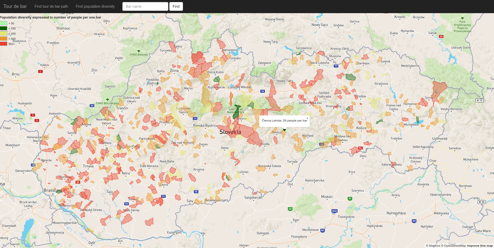

# Overview

This application helps people to choose bar, find parking place and display some interesting statistics. Key features are:
- find first 10 bars with closest location to marker point
- show population diversity(count of people per one bar) in most Slovak villages
- bar searching with closes parking place

Screenshot of find bar path function:


Population diversity screenshot:



The application has 2 separate parts, the client which is a [frontend web application](#frontend) using mapbox API and mapbox.js and the [backend application](#backend) written in PHP using some [Symfony Framework](https://symfony.com/) components and Postgress database with PostGIS extension. Frontend communicates with backend using AJAX. Backend provides Restfull API. 

# Frontend

The frontend application is a static HTML page (`public\html\map.html`), which includes map with navigation bar located on the top of site.  

Frontend application code is located in (`public\js\app.js`) file. Functionality is very simple. Application contains 3 main event listeners which uses AJAX to get [GEOJSON](http://geojson.org/) data, which are showed on the map. Each one handles one key feature:
- show bar path function
- show population diversity function
- find bar with parking place

# Backend

The backend application is written in PHP language. Also, it uses 2 simple  [Symfony](https://symfony.com/)  components:
- **[Routing](http://symfony.com/doc/current/components/routing.html)** - component is responsible for parsing received request, extracting parameters and choosing controller's method. Configuration is located in (`config\routing.json`) file
- **[HttpFoundation](http://symfony.com/doc/current/components/http_foundation.html)** - allows simple creation of request and response objects

Other important backend parts are:
- **controllers** - handles requests and makes responses
- **repository** - contains SQL queries
- **core** - controls request flow  

## Data

Bars and parking places data was downloaded directly from Open Street Maps. After that, data was imported into Postgres database using the `osm2pgsql` tool. For queries speedup, I created indexes onf columns (`way`), (`amenity`) and lower(`name`). All Sql queries returns GeoJson data type transformed  using `st_asgeojson` function. Each result is additionally processed in controllers.     

## Api

**Find bar route**

`GET /bar-route?lat=25346&lng=46346123`

### Response

Response contains ordered GeoJson point, which are connected by lines in application Frontend.
```
[
{"geometry":{
  "type":"Point",
  "coordinates":[17.0385652,48.1859031]},
  "properties":{
    "title":"Red Cafe 3",
    "icon":"bar"
  }
},
{"geometry":
  {"type":"Point",
  "coordinates":[17.0410306,48.1888456]},
  "properties":{
    "title":"\u0160r\u00e1mek",
    "icon":"bar"
  }
}
]
```

**Show population diversity**

`GET /bar-population`

### Response

Response contains GeoJson polygon objects divided into 5 categories based on population diversity number.
```
{
"extraLow":[{
  "geometry":{
    "type":"Polygon",
    "coordinates":[
      [[20.181222,48.740997], [20.18148,48.741321]]
    ]
  }
]},
"low":[{
  "geometry":{
    "type":"Polygon",
    "coordinates":[
      [[20.181222,48.740997], [20.18148,48.741321]]
    ]
  }
]},
"medium":[{
  "geometry":{
    "type":"Polygon",
    "coordinates":[
      [[20.181222,48.740997], [20.18148,48.741321]]
    ]
  }
]},
"high":[{
  "geometry":{
    "type":"Polygon",
    "coordinates":[
      [[20.181222,48.740997], [20.18148,48.741321]]
    ]
  }
]},
"extraHigh":[{
  "geometry":{
    "type":"Polygon",
    "coordinates":[
      [[20.181222,48.740997], [20.18148,48.741321]]
    ]
  }
]},
```

**Find bar parking spot**

`POST /bar-route?lat=25346&lng=46346123`
Form Data: 
  barName: kc dunaj

### Response

Response contains 2 GeoJson points. First is founded bar and second is nearest parking place.
```
[{
"geometry":{
  "type":"Point",
  "coordinates":[17.1099174,48.1451423]},
  "properties":{
    "title":"KC Dunaj",
    "icon":"bar"}
  },
{"geometry":{
  "type":"Point",
  "coordinates":[17.1094894,48.1444062]},
  "properties":{
    "title":"parking place",
    "icon":"car"
  }
}]
```